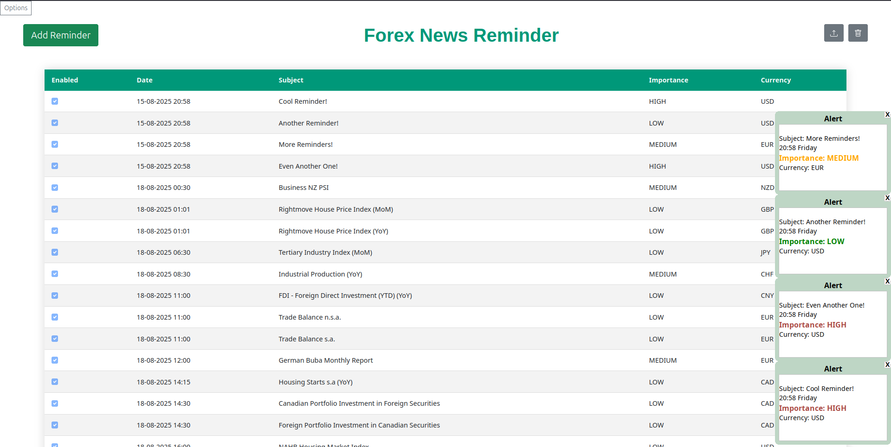

# 📈 ForexReminder


[](#-building-from-source)
[](#-quickstart)
[](https://www.buymeacoffee.com/AdarWa)

[](https://www.buymeacoffee.com/AdarWa)

> ⭐ **If you find ForexReminder useful, please consider giving it a star on GitHub!**  
> It helps others discover the project and supports future development.

**ForexReminder** is a fully offline, web-based forex news reminder system with **powerful customization** for fields, templates, and imports.  
Built for forex news, but flexible enough for other types of reminders.



---


## 📑 Table of Contents
- [✨ Features](#-features)
- [🚀 Quickstart](#-quickstart)
- [⚙ Configuration](#-configuration)
- [🛠 Troubleshooting](#-troubleshooting)
- [📥 Importing Data](#-importing-data)
- [🛠 Building from Source](#-building-from-source)
- [🤝 Contributing](#-contributing)
- [☕ Support](#-support)
- [📜 License](#-license)


---

## ✨ Features

- 🔧 **Flexible Reminder Content** – Add, remove, or customize any fields you need.
- 📥 **Configurable Import System** – FxStreet supported out of the box, with configuration for other sources.
- 🌐 **Web-Based Management** – Control all settings through your browser via a local server (port configurable).
- 📴 **Fully Offline** – Runs entirely on your machine, no cloud required.
- 🗂 **Customizable Templates** – Define how reminders look and behave.

---

## 🚀 Quickstart

1. **Install and Run ForexReminder**
    
    Install a pre-built binary from the [Releases](https://github.com/AdarWa/ForexReminder/releases) page, or alternatively [Build from source]().

2. **Access the web interface**

   Open your browser and go to:

   ```
   http://localhost:8579
   ```

   *(Default port is configured in `settings.yaml` or through settings GUI)*

3. **Import news**

    * Import CSV from [FxStreet](https://www.fxstreet.com/economic-calendar) right away.
    * Or configure a custom importer for other news sources.

---

## ⚙ Configuration

Manage settings in two ways:

1. **Web Interface** – Recommended and easiest method.
2. **Manual Files** – If the web UI is unavailable:

    * `settings.yaml` – General app/server settings.
    * `template.json` – Defines reminder templates and fields.

---

## 🛠 Troubleshooting

* **Logs are required** when reporting issues.
* Logs are stored locally; attach them with your bug report.
* If the web UI fails, try editing configuration files directly.

---

## 📥 Importing Data

* **FxStreet Integration** – Works immediately without extra setup.
* **Custom Importers** – Modify the import configuration for other providers.

---

## 🛠 Building From Source

Building and dependency management is done by gradle.
1. Clone the repository:

    ```bash
    git clone https://github.com/AdarWa/ForexReminder
   ```

2. Run tasks:
    
    - Running:
        ```bash
        ./gradlew run
      ```
    
    - Building jar("fat-jar"):
        ```bash
        ./gradlew shadowJar
      ```
      
    - Building Debian package(only works on Debian machines):
        ```bash
        ./gradlew jpackageLinuxDeb
      ```
    
    - Building Windows package(only works on Windows machines)
        ```bash
        ./gradlew jpackageWindows
      ```

---

## 🤝 Contributing

We welcome contributions!
If submitting a PR:

1. Clearly describe your changes.
2. Attach logs if fixing a bug.
3. Update documentation for new features.

---

## ☕ Support

The project is free, but if you find it useful and want to support development, you can [Buy Me a Coffee](https://www.buymeacoffee.com/AdarWa). Every bit helps and is really appreciated!
[](https://www.buymeacoffee.com/AdarWa)

---

## 📜 License

Licensed under the [MIT License](LICENSE).
